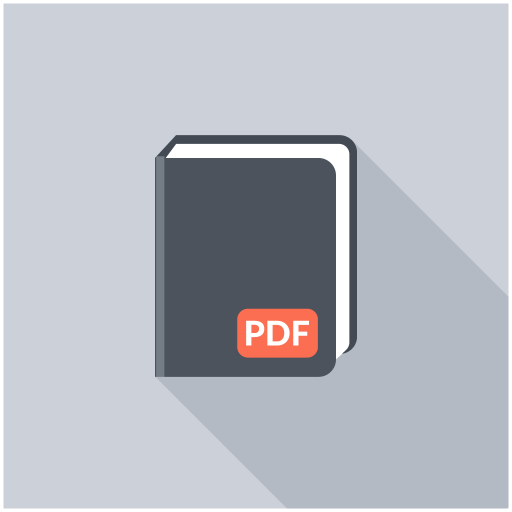

# PDF-Summarizer

## Intro
This is my little project for the interview from MTC
It is a web app, that can summarize pdf lectures in both English and Russian. The program will go through your file, collecting text, links (which can be placed), and if there is an image in it, the application will caption it. Summarizing takes place on each page

Understand the limitations: don't send files with the chemical reactions or mathematical formulas to it,  it'll return you not quite accurate data.

Although I use open source decisions from Hugging Face, I provide notebooks to fine-tune the models for the relevant tasks (to learn more, visit **notebooks**).

PDF-Summarizer is using gpu -> Cuda, however to run the app on the cpu, you can run models with the ONNX runtime

## How to run
To run the web app:
* clone this repo **git clone https://github.com/KornilovaK/PDF-Summarizer.git**
* go to project **cd PDF-Summarizer**
* install the nessasary libraries **pip install -r requirements.txt**
* run with **streamlit run web.py**. It will readdress you to the welcome page

## Demonstrations

